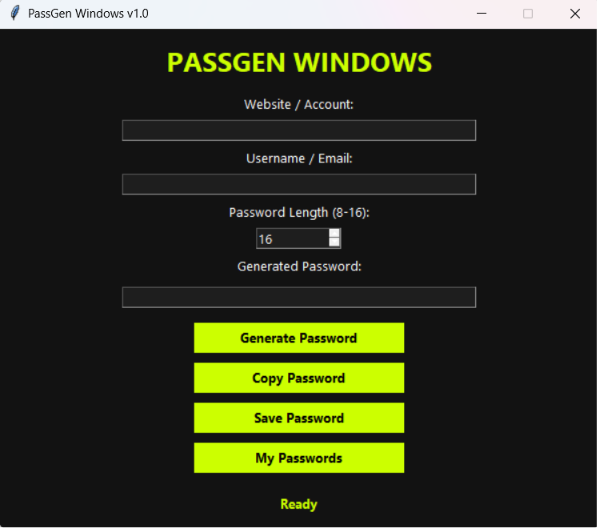

# PassGen Windows based
Modern password generator for Windows, designed and developed from scratch using Python.

     

# PassGen Windows

Modern password generator for Windows built with Python.

---

## Features

- Generate secure passwords
- Password length (8-16)
- Copy password
- Save passwords
- Website / Account support
- Username / Email support

---

## Screenshot

---

## Installation

Download the latest release.

---

## Requirements

Python 3.13+
